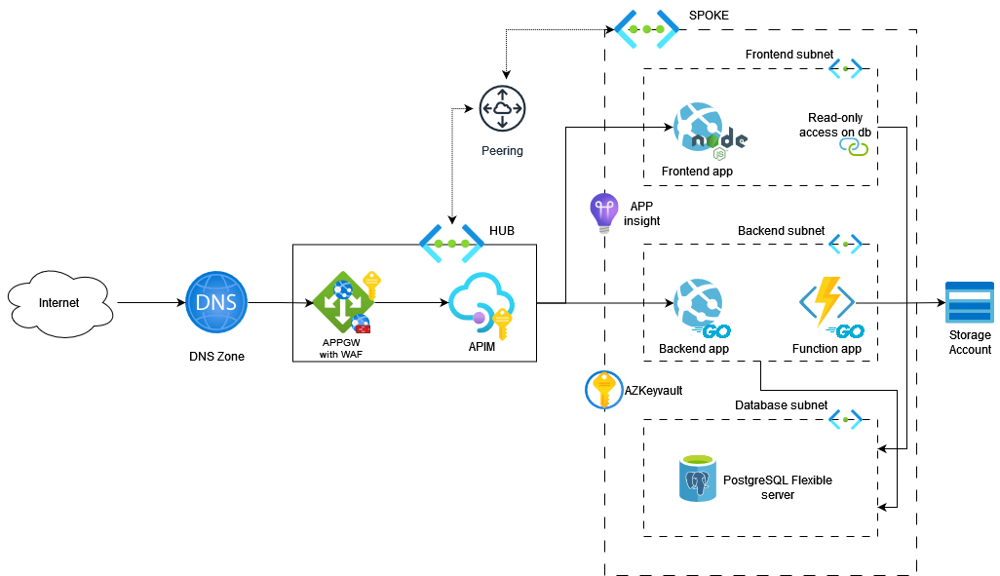
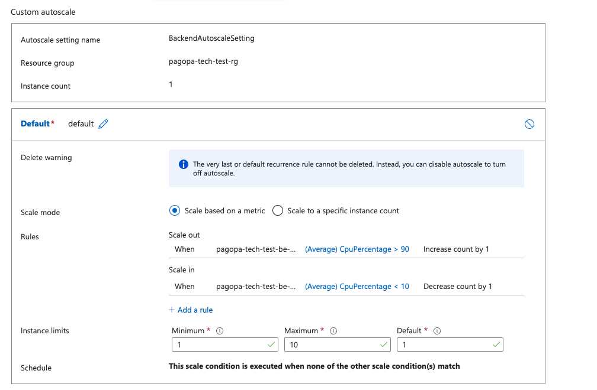

# pagopa-test-ffelici-web-app

## Write a Terraform configuration that will create a production ready infrastructure needed for publishing a web application (frontend and backend) to the internet

## Gitops implementation

GitOps is a modern approach to managing application infrastructure and deployments using Git as a single source of truth. 

The application of the infrastructure was made to be managed through Azure DevOps by first applying with terraform the [gitops](./gitops/) module of this repository.

## Prerequisites

1. **Azure Subscription**: Ensure you have an active Azure subscription.
2. **Azure DevOps Account**: Create an account on Azure DevOps if you don't have one.
3. **Terraform Installed**: Install Terraform on your local machine.
4. **Git Installed**: Ensure Git is installed and configured.

## Infrastructure architecture

This infrastructure includes three main components a web app in nodejs for the frontend, one function app for an assumed backend in golang and one web app for api backend in golang.

### Secure network with APPGW WAF enabled 

Azure Application Gateway with Web Application Firewall (WAF) is a best choice for several reasons:

- Enhanced Security: WAF provides protection against common web vulnerabilities and attacks such as SQL injection, cross-site scripting (XSS), and others, by inspecting incoming traffic.

- Scalability and Availability: It automatically scales based on traffic demands, ensuring high availability and performance for your applications.

- Centralized Management: Simplifies management by acting as a central point for SSL termination, URL-based routing, and load balancing, which reduces the complexity of your infrastructure.

- Integrated Monitoring and Diagnostics: Offers detailed analytics and logging, enabling better insight into traffic patterns and potential threats.

- Cost Efficiency: Consolidates various functions such as load balancing, SSL termination, and WAF into a single service, reducing the need for multiple disparate services and lowering overall costs.

- Compliance: Helps meet regulatory requirements by providing advanced security features and detailed logging for audits.

These features make Azure Application Gateway with WAF an excellent choice for securing, managing, and optimizing web application delivery.

### Database

Azure Database for PostgreSQL Flexible Server is a better choice due to its enhanced control, flexibility, and cost-efficiency. It offers greater customization of maintenance windows, backup retention, and performance tuning. Additionally, it supports deployment across multiple availability zones for high availability, provides more granular scaling options, and allows stopping and starting the server to save costs during idle periods. This makes it ideal for complex, variable workloads that require high availability and custom configurations.

### Monitoring

Monitoring applications and diagnosing logs in Azure are critical for several reasons, ensuring optimal performance, security, and cost-effectiveness of cloud-based services. Here are the key points highlighting their importance:

- Resource Utilization: Monitoring tools provide insights into resource usage (CPU, memory, disk, network), helping to identify underutilized or overburdened resources. This allows for better resource allocation and scaling decisions.

- Application Performance: Detailed monitoring of application performance metrics such as response time, request rates, and error rates helps identify performance bottlenecks and optimize code and configurations.

- Threat Detection: Continuous monitoring can detect unusual or unauthorized activities, helping to identify potential security threats and breaches in real-time.

- Compliance: For industries with strict regulatory requirements, logging and monitoring ensure that all activities are tracked and recorded, aiding in compliance and audit processes.

- Root Cause Analysis: Log diagnostics enable detailed examination of system and application logs to trace issues back to their root causes, significantly reducing the time required to resolve problems.

- Error Tracking: Monitoring tools can automatically detect and alert on errors and exceptions, allowing for immediate attention and quick resolution.

- Cost Optimization: By monitoring resource usage and application performance, businesses can identify opportunities to optimize costs by scaling resources up or down based on demand and usage patterns.

- Avoidance of Over-provisioning: Detailed insights help avoid over-provisioning resources, ensuring that you only pay for what you need.

- Centralized Management: Azure’s monitoring and diagnostic tools provide a centralized view of the health and performance of all cloud resources, simplifying management and oversight.

## Applications scaling

App services in a consonant cutoff that enables autoscaling fetaure have custom metrics in place to perform scaling based on CPU utilization greater than 90%.

<!-- BEGINNING OF PRE-COMMIT-TERRAFORM DOCS HOOK -->
## Requirements

| Name | Version |
|------|---------|
|  [terraform](#requirement\_terraform) | >= 1.0 |
|  [azurerm](#requirement\_azurerm) | 3.52.0 |
|  [random](#requirement\_random) | 3.6.2 |

## Providers

| Name | Version |
|------|---------|
|  [azurerm](#provider\_azurerm) | 3.52.0 |
|  [random](#provider\_random) | 3.6.2 |

## Modules

| Name | Source | Version |
|------|--------|---------|
|  [app\_gw](#module\_app\_gw) | ./modules/application_gateway | n/a |

## Resources

| Name | Type |
|------|------|
| [azurerm_api_management.apim](https://registry.terraform.io/providers/hashicorp/azurerm/3.52.0/docs/resources/api_management) | resource |
| [azurerm_api_management_custom_domain.api_custom_domain](https://registry.terraform.io/providers/hashicorp/azurerm/3.52.0/docs/resources/api_management_custom_domain) | resource |
| [azurerm_application_insights.main](https://registry.terraform.io/providers/hashicorp/azurerm/3.52.0/docs/resources/application_insights) | resource |
| [azurerm_dns_a_record.dns_a_api](https://registry.terraform.io/providers/hashicorp/azurerm/3.52.0/docs/resources/dns_a_record) | resource |
| [azurerm_dns_a_record.dns_a_management](https://registry.terraform.io/providers/hashicorp/azurerm/3.52.0/docs/resources/dns_a_record) | resource |
| [azurerm_dns_a_record.dns_a_portal](https://registry.terraform.io/providers/hashicorp/azurerm/3.52.0/docs/resources/dns_a_record) | resource |
| [azurerm_dns_zone.public](https://registry.terraform.io/providers/hashicorp/azurerm/3.52.0/docs/resources/dns_zone) | resource |
| [azurerm_key_vault.kvault](https://registry.terraform.io/providers/hashicorp/azurerm/3.52.0/docs/resources/key_vault) | resource |
| [azurerm_key_vault_access_policy.apim_policy](https://registry.terraform.io/providers/hashicorp/azurerm/3.52.0/docs/resources/key_vault_access_policy) | resource |
| [azurerm_key_vault_access_policy.app_gateway_policy](https://registry.terraform.io/providers/hashicorp/azurerm/3.52.0/docs/resources/key_vault_access_policy) | resource |
| [azurerm_key_vault_certificate.certificate_api](https://registry.terraform.io/providers/hashicorp/azurerm/3.52.0/docs/resources/key_vault_certificate) | resource |
| [azurerm_key_vault_certificate.certificate_management](https://registry.terraform.io/providers/hashicorp/azurerm/3.52.0/docs/resources/key_vault_certificate) | resource |
| [azurerm_key_vault_certificate.certificate_portal](https://registry.terraform.io/providers/hashicorp/azurerm/3.52.0/docs/resources/key_vault_certificate) | resource |
| [azurerm_key_vault_secret.postgresql_password](https://registry.terraform.io/providers/hashicorp/azurerm/3.52.0/docs/resources/key_vault_secret) | resource |
| [azurerm_key_vault_secret.postgresql_password_ro](https://registry.terraform.io/providers/hashicorp/azurerm/3.52.0/docs/resources/key_vault_secret) | resource |
| [azurerm_key_vault_secret.psql_connection_string](https://registry.terraform.io/providers/hashicorp/azurerm/3.52.0/docs/resources/key_vault_secret) | resource |
| [azurerm_key_vault_secret.psql_connection_string_ro](https://registry.terraform.io/providers/hashicorp/azurerm/3.52.0/docs/resources/key_vault_secret) | resource |
| [azurerm_linux_function_app.backend-core](https://registry.terraform.io/providers/hashicorp/azurerm/3.52.0/docs/resources/linux_function_app) | resource |
| [azurerm_linux_web_app.backend-transaction](https://registry.terraform.io/providers/hashicorp/azurerm/3.52.0/docs/resources/linux_web_app) | resource |
| [azurerm_linux_web_app.frontend](https://registry.terraform.io/providers/hashicorp/azurerm/3.52.0/docs/resources/linux_web_app) | resource |
| [azurerm_log_analytics_workspace.main](https://registry.terraform.io/providers/hashicorp/azurerm/3.52.0/docs/resources/log_analytics_workspace) | resource |
| [azurerm_monitor_autoscale_setting.backend](https://registry.terraform.io/providers/hashicorp/azurerm/3.52.0/docs/resources/monitor_autoscale_setting) | resource |
| [azurerm_monitor_autoscale_setting.frontends](https://registry.terraform.io/providers/hashicorp/azurerm/3.52.0/docs/resources/monitor_autoscale_setting) | resource |
| [azurerm_monitor_diagnostic_setting.psql_diagnostics](https://registry.terraform.io/providers/hashicorp/azurerm/3.52.0/docs/resources/monitor_diagnostic_setting) | resource |
| [azurerm_postgresql_active_directory_administrator.database](https://registry.terraform.io/providers/hashicorp/azurerm/3.52.0/docs/resources/postgresql_active_directory_administrator) | resource |
| [azurerm_postgresql_flexible_server.database](https://registry.terraform.io/providers/hashicorp/azurerm/3.52.0/docs/resources/postgresql_flexible_server) | resource |
| [azurerm_postgresql_flexible_server_configuration.connection_throttling](https://registry.terraform.io/providers/hashicorp/azurerm/3.52.0/docs/resources/postgresql_flexible_server_configuration) | resource |
| [azurerm_postgresql_flexible_server_configuration.log_checkpoints](https://registry.terraform.io/providers/hashicorp/azurerm/3.52.0/docs/resources/postgresql_flexible_server_configuration) | resource |
| [azurerm_postgresql_flexible_server_configuration.log_connections](https://registry.terraform.io/providers/hashicorp/azurerm/3.52.0/docs/resources/postgresql_flexible_server_configuration) | resource |
| [azurerm_postgresql_flexible_server_configuration.readonly_permissions](https://registry.terraform.io/providers/hashicorp/azurerm/3.52.0/docs/resources/postgresql_flexible_server_configuration) | resource |
| [azurerm_postgresql_flexible_server_database.database](https://registry.terraform.io/providers/hashicorp/azurerm/3.52.0/docs/resources/postgresql_flexible_server_database) | resource |
| [azurerm_private_dns_zone.database](https://registry.terraform.io/providers/hashicorp/azurerm/3.52.0/docs/resources/private_dns_zone) | resource |
| [azurerm_private_dns_zone_virtual_network_link.database](https://registry.terraform.io/providers/hashicorp/azurerm/3.52.0/docs/resources/private_dns_zone_virtual_network_link) | resource |
| [azurerm_public_ip.app_gw_public_ip](https://registry.terraform.io/providers/hashicorp/azurerm/3.52.0/docs/resources/public_ip) | resource |
| [azurerm_resource_group.rg](https://registry.terraform.io/providers/hashicorp/azurerm/3.52.0/docs/resources/resource_group) | resource |
| [azurerm_service_plan.app-service-be-plan](https://registry.terraform.io/providers/hashicorp/azurerm/3.52.0/docs/resources/service_plan) | resource |
| [azurerm_service_plan.app-service-fe-plan](https://registry.terraform.io/providers/hashicorp/azurerm/3.52.0/docs/resources/service_plan) | resource |
| [azurerm_storage_account.functions](https://registry.terraform.io/providers/hashicorp/azurerm/3.52.0/docs/resources/storage_account) | resource |
| [azurerm_subnet.application_gateway](https://registry.terraform.io/providers/hashicorp/azurerm/3.52.0/docs/resources/subnet) | resource |
| [azurerm_subnet.backend](https://registry.terraform.io/providers/hashicorp/azurerm/3.52.0/docs/resources/subnet) | resource |
| [azurerm_subnet.database](https://registry.terraform.io/providers/hashicorp/azurerm/3.52.0/docs/resources/subnet) | resource |
| [azurerm_subnet.frontend](https://registry.terraform.io/providers/hashicorp/azurerm/3.52.0/docs/resources/subnet) | resource |
| [azurerm_user_assigned_identity.apim](https://registry.terraform.io/providers/hashicorp/azurerm/3.52.0/docs/resources/user_assigned_identity) | resource |
| [azurerm_user_assigned_identity.appgateway](https://registry.terraform.io/providers/hashicorp/azurerm/3.52.0/docs/resources/user_assigned_identity) | resource |
| [azurerm_virtual_network.vnet-app](https://registry.terraform.io/providers/hashicorp/azurerm/3.52.0/docs/resources/virtual_network) | resource |
| [azurerm_virtual_network.vnet-hub](https://registry.terraform.io/providers/hashicorp/azurerm/3.52.0/docs/resources/virtual_network) | resource |
| [azurerm_virtual_network_peering.hub-spoke](https://registry.terraform.io/providers/hashicorp/azurerm/3.52.0/docs/resources/virtual_network_peering) | resource |
| [azurerm_virtual_network_peering.spoke-hub](https://registry.terraform.io/providers/hashicorp/azurerm/3.52.0/docs/resources/virtual_network_peering) | resource |
| [random_password.psql_password](https://registry.terraform.io/providers/hashicorp/random/3.6.2/docs/resources/password) | resource |
| [random_password.psql_password_ro](https://registry.terraform.io/providers/hashicorp/random/3.6.2/docs/resources/password) | resource |
| [azurerm_client_config.current](https://registry.terraform.io/providers/hashicorp/azurerm/3.52.0/docs/data-sources/client_config) | data source |

## Inputs

| Name | Description | Type | Default | Required |
|------|-------------|------|---------|:--------:|
|  [app\_backend\_sku](#input\_app\_backend\_sku) | (Required) The SKU for beckend the plan. | `string` | `"B1"` | no |
|  [app\_frontend\_sku](#input\_app\_frontend\_sku) | (Required) The SKU for frontend the plan. | `string` | `"B1"` | no |
|  [app\_gateway\_is\_enabled](#input\_app\_gateway\_is\_enabled) | (Optional) Enable the App Gateway to be deployed. | `bool` | n/a | yes |
|  [app\_gateway\_max\_capacity](#input\_app\_gateway\_max\_capacity) | (Optional) Maximum capacity for autoscaling. Accepted values are in the range 2 to 125. | `string` | `"3"` | no |
|  [app\_gateway\_min\_capacity](#input\_app\_gateway\_min\_capacity) | (Required) Minimum capacity for autoscaling. Accepted values are in the range 0 to 100. | `string` | `"1"` | no |
|  [app\_gateway\_sku\_name](#input\_app\_gateway\_sku\_name) | Application Gateway SKU name | `string` | n/a | yes |
|  [app\_gateway\_sku\_tier](#input\_app\_gateway\_sku\_tier) | Application Gateway SKU tier | `string` | n/a | yes |
|  [app\_gateway\_waf\_enabled](#input\_app\_gateway\_waf\_enabled) | (Optional) Enable the WAF the App Gateway. | `bool` | n/a | yes |
|  [external\_domain](#input\_external\_domain) | Dns external domain for the resources that will be created | `string` | `"test"` | no |
|  [location](#input\_location) | (Required) The Azure location where the API Management Service exists. Changing this forces a new resource to be created. | `string` | n/a | yes |
|  [prefix](#input\_prefix) | n/a | `string` | `"Prefix for the resources that will be created"` | no |
|  [resource\_group\_name](#input\_resource\_group\_name) | (Required) The name of the Resource Group in which the API Management Service should be exist. Changing this forces a new resource to be created. | `string` | n/a | yes |
|  [tags](#input\_tags) | (Optional) The tags associated on this deployment. | `map(string)` | `{}` | no |

## Outputs

No outputs.
<!-- END OF PRE-COMMIT-TERRAFORM DOCS HOOK -->
